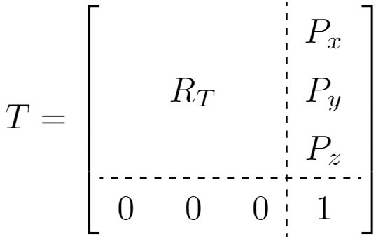
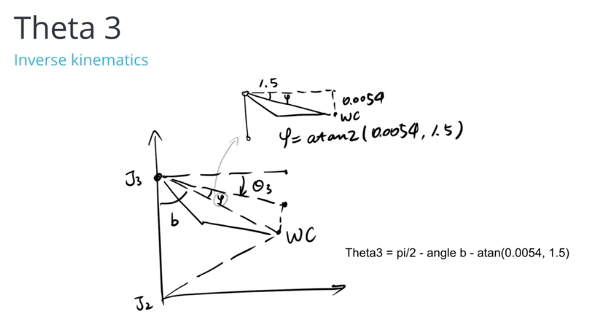

# Robotic-arm---Pick-Place-project

## Table of Contents:
1. Environment & Installation
3. Forward Kinematics
4. Inverse Kinematics
5. Screenshots

# 1. Environment & Installation
Make sure you are using robo-nd VM or have Ubuntu+ROS installed locally.

One time Gazebo setup step:
Check the version of gazebo installed on your system using a terminal:

$ gazebo --version
To run projects from this repository you need version 7.7.0+ If your gazebo version is not 7.7.0+, perform the update as follows:

$ sudo sh -c 'echo "deb http://packages.osrfoundation.org/gazebo/ubuntu-stable `lsb_release -cs` main" > /etc/apt/sources.list.d/gazebo-stable.list'
$ wget http://packages.osrfoundation.org/gazebo.key -O - | sudo apt-key add -
$ sudo apt-get update
$ sudo apt-get install gazebo7
Once again check if the correct version was installed:

$ gazebo --version
For the rest of this setup, catkin_ws is the name of active ROS Workspace, if your workspace name is different, change the commands accordingly
If you do not have an active ROS workspace, you can create one by:

$ mkdir -p ~/catkin_ws/src
$ cd ~/catkin_ws/
$ catkin_make
Now that you have a workspace, clone or download this repo into the src directory of your workspace:

$ cd ~/catkin_ws/src
$ git clone https://github.com/udacity/RoboND-Kinematics-Project.git
Now from a terminal window:

$ cd ~/catkin_ws
$ rosdep install --from-paths src --ignore-src --rosdistro=kinetic -y
$ cd ~/catkin_ws/src/RoboND-Kinematics-Project/kuka_arm/scripts
$ sudo chmod +x target_spawn.py
$ sudo chmod +x IK_server.py
$ sudo chmod +x safe_spawner.sh
Build the project:

$ cd ~/catkin_ws
$ catkin_make
Add following to your .bashrc file

export GAZEBO_MODEL_PATH=~/catkin_ws/src/RoboND-Kinematics-Project/kuka_arm/models

source ~/catkin_ws/devel/setup.bash
For demo mode make sure the demo flag is set to "true" in inverse_kinematics.launch file under /RoboND-Kinematics-Project/kuka_arm/launch

In addition, you can also control the spawn location of the target object in the shelf. To do this, modify the spawn_location argument in target_description.launch file under /RoboND-Kinematics-Project/kuka_arm/launch. 0-9 are valid values for spawn_location with 0 being random mode.

You can launch the project by

$ cd ~/catkin_ws/src/RoboND-Kinematics-Project/kuka_arm/scripts
$ ./safe_spawner.sh
If you are running in demo mode, this is all you need. To run your own Inverse Kinematics code change the demo flag described above to "false" and run your code (once the project has successfully loaded) by:

$ cd ~/catkin_ws/src/RoboND-Kinematics-Project/kuka_arm/scripts
$ rosrun kuka_arm IK_server.py
Once Gazebo and rviz are up and running, make sure you see following in the gazebo world:

- Robot

- Shelf

- Blue cylindrical target in one of the shelves

- Dropbox right next to the robot
If any of these items are missing, report as an issue.

Once all these items are confirmed, open rviz window, hit Next button.

To view the complete demo keep hitting Next after previous action is completed successfully.

Since debugging is enabled, you should be able to see diagnostic output on various terminals that have popped up.

The demo ends when the robot arm reaches at the top of the drop location.

There is no loopback implemented yet, so you need to close all the terminal windows in order to restart.

In case the demo fails, close all three terminal windows and rerun the script.

# 2 - Forward Kinematic
We use the forward kinematics to calculate the final coordinate position and rotation of end-effector

## 1 - Extracting joint positions and orientations from URDF file.

from the URDF file `kr210.urdf.xacro` we can extract the position xyz and orientation rpy of each joint from **origin** tag in each joint XML section:

for example, from the following fixed base joint XML section:

```xml
 <!-- joints -->
  <joint name="fixed_base_joint" type="fixed">
    <parent link="base_footprint"/>
    <child link="base_link"/>
    <origin xyz="0 0 0" rpy="0 0 0"/>
  </joint>
```
Following table is showing Denavit - Hartenberg DH parameters

i | alpha | a | d | theta
---- | ---- | ---- | ---- | ----
1 | 0 | 0 | 0.75 | theta_1
2 | -pi/2 | 0.35 | 0 | theta_2 - pi/2
3 | 0 | 1.25 | 0 | theta_3
4 | -pi/2 | -0.054 | 1.5 | theta_4
5 | pi/2 | 0 | 0 | theta_5
6 | -pi/2 | 0 | 0 | theta_6
7 | 0 | 0 | 0.303 | theta_7

### Now we able to know each joint position and extract an image for the robot building the DH diagram. 


## 2 define symbols.

```python

        # Create symbols
	q1, q2, q3, q4, q5, q6, q7 = symbols('q1:8') #for theta values
        d1, d2, d3, d4, d5, d6, d7 = symbols('d1:8')
        a0, a1, a2, a3, a4, a5, a6 = symbols('a0:7')
        alpha0, alpha1, alpha2, alpha3, alpha4, alpha5 , alpha6 = symbols('alpha0:7')#Twisting angles
```
### DH parameters Table :

```python
DH_T = {alpha0:     0,  a0:     0,  d1:   0.75,
     alpha1: -pi/2,  a1:  0.35,  d2:      0, q2:  q2-pi/2,
     alpha2:     0,  a2:  1.25,  d3:      0,
     alpha3: -pi/2,  a3:-0.054,  d4:    1.5,
     alpha4:  pi/2,  a4:     0,  d5:      0,
     alpha5: -pi/2,  a5:     0,  d6:      0,
     alpha6:     0,  a6:     0,  d7:  0.303, q7:     0}
```

## 4 -Creating the individual transformation matrices about each joint
to describe the relative translation and orientation of link (i-1) to link (i)





Homogenous Transforms function

```python
def matrix(alpha, a, d, q):
    res = Matrix([[             cos(q),            -sin(q),            0,              a],
                     [  sin(q)*cos(alpha),  cos(q)*cos(alpha),  -sin(alpha),  -sin(alpha)*d],
                     [  sin(q)*sin(alpha),  cos(q)*sin(alpha),   cos(alpha),   cos(alpha)*d],
                     [                  0,                  0,            0,              1]])
    return res
```
Then using the following code to substitute the DH parameters into the transformation matrix:

```python
TF0_1 = matrix(alpha0,a0, d1,q1).subs(DH_T)

	TF1_2 = matrix(alpha1, a1, d2,q2).subs(DH_T)

	TF2_3 = matrix(alpha2, a2, d3,q3).subs(DH_T)

	TF3_4 = matrix(alpha3, a3, d4,q4).subs(DH_T)

	TF4_5 = matrix(alpha4, a4, d5,q5).subs(DH_T)
	TF5_6 = matrix(alpha5, a5, d6,q6).subs(DH_T)

	TF6_G = matrix(alpha6, a6, d7,q7).subs(DH_T)


```
To get the composition of all transforms from base to gripper :

```python
# Composition of Homogeneous Transforms
# Transform from Base link to EE (Gripper)

	TF0_G = simplify(TF0_1 * TF1_2 * TF2_3 * TF3_4 * TF4_5 * TF5_6 * TF6_G)
```

## 4 - we have to Compensate for rotation discrepancy between DH parameters and Gazebo
```python

def rot_x(q):
	R_x = Matrix([[     1,                0,               0,     0],
                  [     0,       cos(q),     -sin(q),     0],
				  [     0,       sin(q),      cos(q),     0],
				  [     0,                0,               0,     1]])
	return R_x

def rot_y(angle):
	R_y = Matrix([[    cos(angle),                0,    sin(angle),     0],
					[             0,                1,             0,     0],
					[   -sin(angle),                0,    cos(angle),     0],
					[             0,                0,             0,     1]])
	return R_y

def rot_z(q):
	R_z = Matrix([[       cos(q),      -sin(q),          0,      0],
				  [       sin(q),       cos(q),          0,      0],
				  [                0,                0,          1,      0],
				  [                0,                0,          0,      1]])
	return R_z

R_corr = simplify(rot_z(pi) * rot_y(-pi/2))
```

# 3 - Inverse Kinematics

### 1. first we have to get the end-effector position and the rotation matrix for it as following:
```python
# rotation matrix for EE
Rot_EE = rot_z(yaw)[0:3,0:3] * rot_y(pitch)[0:3,0:3] * rot_x(roll)[0:3,0:3] * R_corr[0:3,0:3]
EE_Pos = Matrix([[px],[py],[pz]])
WC = EE_Pos - 0.303 * Rot_EE[:,2] # EE  relative to WC 
```
### 2. Since the last three joints in our robot are revolute and their joint axes intersect at a single point, we have a case of spherical wrist with joint_5 being the common intersection point and hence the wrist center.

This allows us to kinematically decouple the IK problem into `Inverse Position` and `Inverse Orientation`

### 3. first `Inverse Position` 
for the first angle theta_1, it is between x-axis and y-axis we can use tan inverse to get it

```python
theta_1 = atan2(WC[1],WC[0])
```




```python
new_wx = sqrt(WC[0]**2 + WC[1]**2) - 0.35
new_wz = WC[2] - 0.75 # WC_Z - d1
B = sqrt(new_wx**2 + new_wz**2)

# A and C fixed length from urdf
C = 1.25
A = 1.5

# cos(a) = (B^2 + C^2 - A^2) / (2* C * A)
angle_a = math.acos(( pow(B,2) + pow(C,2) - pow(A,2) ) / ( 2 * B * C ))
theta_2 = pi/2 - angle_a - atan2(new_wz,new_wx)

# to get theta 3 we have to calculate angle_b first as follows:-
angle_b = math.acos((pow(C,2) + pow(A,2) - pow(B,2)) / (2 * C * A))
theta_3 = pi/2 - angle_b - 0.03598 # 0.03598 is fixed angle = atan2(0.054,1.5)

```

### 4. for the `Inverse Orientation` to calculate the last three angles
we have to calculate the rotation matrix between base link and joint 3 = R0_3 then we are able to calculate R3_6


```python
TF0_2 = simplify(TF0_1 * TF1_2)
TF0_3 = simplify(TF0_2 * TF2_3)
R0_3 = TF0_3.evalf(subs={q1: theta_1, q2: theta_2, q3: theta_3})[0:3,0:3]
	    
R3_6 = R0_3.inv("LU") * Rot_EE
```
now we can calculate the last three joints from the matrix `R3_6`


```python
theta_4 = atan2(R3_6[2, 2], -R3_6[0, 2])
theta_5 = atan2(sqrt(R3_6[0, 2]*R3_6[0, 2]+R3_6[2, 2]*R3_6[2, 2]), R3_6[1, 2])
theta_6 = atan2(-R3_6[1, 1], R3_6[1, 0])
```


# 4 - Screenshots 
!(misc_images/misc4.png)

!(misc_images/misc5.png)

!(misc_images/misc6.png)
!(misc_images/misc_7.png)
!(misc_images/misc8.png)

